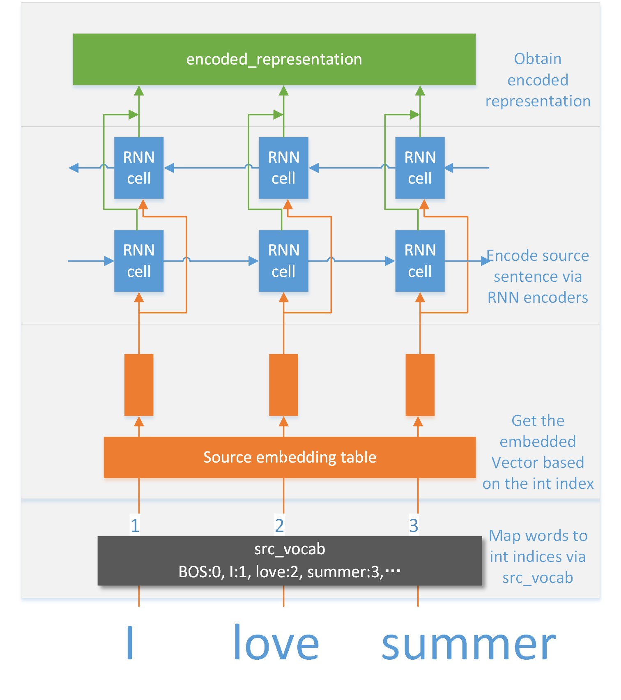
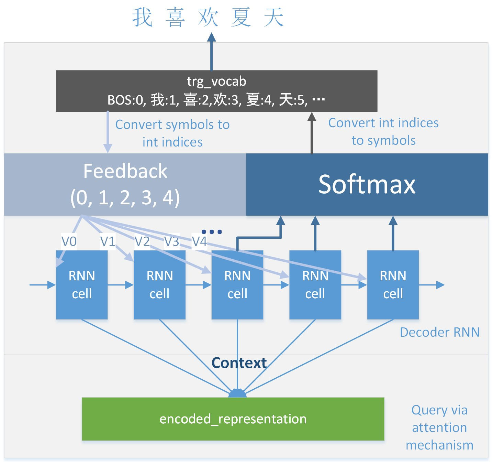
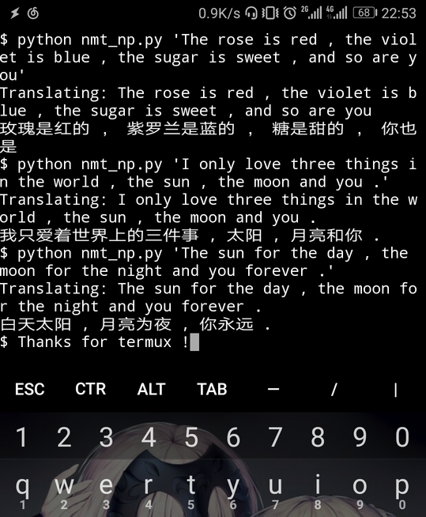

Sequencing
===================

**Sequencing** is a sequence to sequence learning framework based on Tensorflow. The
key features of this framework are flexibility and simplicity. That is, keep
 simple and stay native.

### Dependency
1. Python >= 3.5 (please forget Python 2)
2. Tensorflow >= 1.2
3. numpy >= 1.12

Please run `nosetests tests` to verify whether it is ready.

----------


How to use
-------------

You may refer to the [introduction](https://blog.slinuxer.com/2017/08/sequencing) in Chinese.

This code has been tested on neural machine translation (NMT), thus we would
use translation as the demo. The typical architecture of NMT consists of
three components, that is an encoder,  an decoder and attention mechanism.
You may refer to
[Neural Machine Translation by Jointly Learning to Align and Translate](https://arxiv.org/abs/1409.0473)
for more details.

We would introduce how to build a NMT system from scratch step by step. You
may check [nmt.py](nmt.py) for the implementation.

### Prepare the training data and vocabulary
We may need many parallel sentences to train a reasonable NMT system. For
English to Chinese translation, we could crawl a lots of data from several
 websites, for example, [youdao](http://www.youdao.com/example/blng/eng/reasonable).
After preparing the training data, we need to construct the vocabulary of
each language.  For English, we may use [BPE](https://github.com/rsennrich/subword-nmt) 
or just words. For a toy example, 32K words are
enough.  For Chinese, we may use Chinese characters as the basic units
instead of words for simplicity.

Then, we need to build the parallel inputs (English to Chinese) for training.
```
# load vocab
src_vocab = build_vocab(src_vocab_file, src_embedding_dim, ' ')
trg_vocab = build_vocab(trg_vocab_file, trg_embedding_dim, '')

# load parallel data
parallel_data_generator = \
    build_parallel_inputs(src_vocab, trg_vocab,
                          src_data_file, trg_data_file,
                          batch_size=batch_size, buffer_size=96,
                          mode=MODE.TRAIN)
```

### Encoder

We only implement the RNN encoder in current version. We may add the
[CNN encoder](https://arxiv.org/abs/1705.03122) and 
[self-attention encoder](https://arxiv.org/abs/1706.03762) in the future,
contribution is welcome.

We may use `StackBidirectionalRNNEncoder` to encoder sentences,
```
encoder = sq.StackBidirectionalRNNEncoder(encoder_params, name='stack_rnn', mode=mode)
encoded_representation = encoder.encode(source_embedded, source_seq_length)
```

`source_embedded` is the embedded representation of source words, which is
generated by a lookup table,
```
source_embedding_table = sq.LookUpOp(src_vocab.vocab_size,
                                     src_vocab.embedding_dim,
                                     name='source')
source_embedded = source_embedding_table(source_ids)
```

The encoder is illustrated in the following figure.
<p align='center'>

</p>


### Attention mechanism

Attention is necessary for NMT. We implement the basic attention mechanism.
Of course, it is extremely easy to extend, please check the [source code](sequencing/attention).
```
attention_keys = encoded_representation.attention_keys
attention_values = encoded_representation.attention_values
attention_length = encoded_representation.attention_length
attention = sq.Attention(query_size, attention_keys, attention_values, attention_length)
```

The basic attention mechanism is very simple. For example, 
given a query *query* (usually the hidden states of the decoder), the attented context could be calculated as,
```
energies = v * tanh(keys + query)  # add query to each key
scores = softmax(energies)
# multiply each value with corresponding score, then sum up weighted values.
context = sum(scores * values)
```


### Decoder
The RNN decoder with attention is good enough, and we need a feedback to
teach the learning process. For example,
```
feedback = sq.TrainingFeedBack(target_ids, target_seq_length,
                               trg_vocab, teacher_rate)
# decoder
decoder = sq.AttentionRNNDecoder(decoder_params, attention,
                                 feedback, mode=mode)
```
We also provide the graphical illustration, but it does not match the code exactly.
The code is definitely precise. 
<p align='center'>

</p>


### Training
We have build the NMT model, next we would like to train this model. Before
training, we need to obtain the outputs of the model and define a loss. We
use a `dynamic_decode` to decode from the model, which is similar to
[seq2seq](https://github.com/google/seq2seq), however simplified.
```
decoder_output, decoder_final_state = sq.dynamic_decode(decoder, scope='decoder')
```
`decoder_output` contains the `logits`, which could be used to define the loss,
```
predict_ids = target_ids
losses = cross_entropy_sequence_loss(
             logits=decoder_output.logits,
             targets=predict_ids,
             sequence_length=target_seq_length)
```
Finally, we may use an optimizer to train our model, such as
`GradientDescentOptimizer` and `AdamOptimizer`.

### Inferring
For greedy inference, we only need to set `teacher_rate` to 0 in
`TrainingFeedBack`. We also implement the inference using batched beam.
Please check [build_model.py](build_model.py) for the details.

### Speed
Training is very fast using the default setting (both the encoder and the decoder are a single layer RNN with 1024 hidden units).
It could iterate over 30,000,000 sentences in one days (350 sentences per seconds) on a single Titan Xp.
Inferring is also fast, it only takes 1 minute to translate 2000 English sentences.


Sequencing NP !
-------------------------------

We also provide a framework that only depends on numpy, however, only for
inference. We could load the trained parameters to sequencing_np and
infer without using Tensorflow. For example, inferring on Android !
<p align='center'>

</p>


Why this framework ?
-------------------------------

We write this framework for lab mates and for fun. We want to keep the code
simple and easy to modify.


TODO
--------------------------------
1. documention
2. implement the CNN encoder and self-attention encoder.
3. improve sequencing_np and support [minpy](https://github.com/dmlc/minpy)
or [cupy](https://github.com/cupy/cupy).
4. distributed training.


